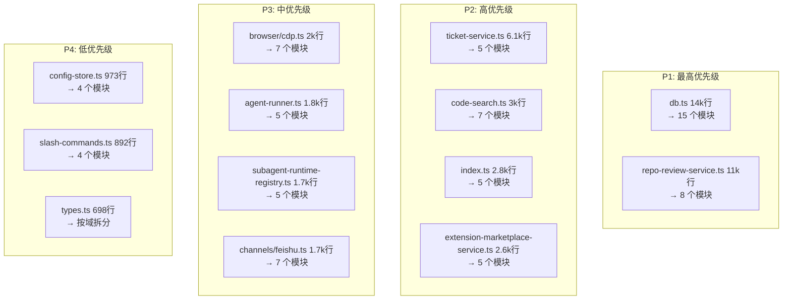

# NanoClaw 后端全量 Code Review 报告

> **注意**: 本文档为历史审查快照。其中提及的 `ticket-service`、`ticket-routes`、`src/db/ticket.ts` 等工单模块已在后续版本中移除，相关章节仅供历史参考。

> 审查日期: 2026-04-08  
> 审查范围: `src/` 下全部 278 个 .ts 文件  
> 审查维度: 结构、正确性、兼容性、性能、安全性、可维护性

---

## 目录

- [总体概览](#总体概览)
- [M1 数据层](#m1-数据层)
- [M2 主运行时](#m2-主运行时)
- [M3 HTTP 层](#m3-http-层)
- [M4 渠道集成](#m4-渠道集成)
- [M5 Agent 运行](#m5-agent-运行)
- [M6 记忆系统](#m6-记忆系统)
- [M7 代码审查服务](#m7-代码审查服务)
- [M8 工单系统](#m8-工单系统)
- [M9 股票分析](#m9-股票分析)
- [M10 浏览器自动化](#m10-浏览器自动化)
- [M11 基础设施](#m11-基础设施)
- [大文件拆分总览](#大文件拆分总览)
- [按优先级排序的修复清单](#按优先级排序的修复清单)
- [实施建议](#实施建议)

---

## 总体概览

### 发现统计

| 严重性 | 数量 | 说明 |
|--------|------|------|
| **P0 Critical** | 2 | 生产 bug，立即修复 |
| **P1 High** | 17 | 安全/性能/兼容性风险 |
| **P2 Medium** | 30 | 结构性技术债、中等风险 |
| **P3 Low** | 27 | 代码风格、小改进 |
| **Info** | 14 | 记录、无需修改 |
| **总计** | **90** | |

### 大文件统计（需拆分）

| 文件 | 行数 | 建议拆分为 |
|------|------|-----------|
| `src/db.ts` | 14,236 | ~15 个模块 |
| `src/repo-review-service.ts` | 11,002 | ~8 个模块 |
| `src/ticket-service.ts` | 6,142 | ~5 个模块 |
| `src/code-search.ts` | 3,010 | ~7 个模块 |
| `src/index.ts` | 2,822 | ~5 个模块 |
| `src/extension-marketplace-service.ts` | 2,610 | ~5 个模块 |
| `src/browser/cdp.ts` | 1,955 | ~7 个模块 |
| `src/agent-runner.ts` | 1,792 | ~5 个模块 |
| `src/subagent-runtime-registry.ts` | 1,727 | ~5 个模块 |
| `src/channels/feishu.ts` | 1,657 | ~7 个模块 |
| `src/config-store.ts` | 973 | ~4 个模块 |
| `src/slash-commands.ts` | 892 | ~4 个模块 |

---

## M1 数据层

**范围**: `src/db.ts`, `src/database/*`, `src/tenant-db.ts`, `src/db.test.ts`

### 发现列表

| ID | 严重性 | 维度 | 文件 | 描述 | 建议 |
|----|--------|------|------|------|------|
| M1-01 | P1 | 正确性/兼容性 | `db.ts` ~4853 | `updateChatName` 和 `setLastGroupSync` upsert `chats` 时缺少 `user_id`，新行依赖列默认值 `__system__`，与 `storeChatMetadata` 语义不一致 | 对齐 `storeChatMetadata`：包含 `getCurrentUserId()` |
| M1-02 | P1 | 正确性/安全 | `db.ts` ~9781 | `getConversationDisplayNames` 按 `jid IN (...)` 查询无 `user_id` 过滤，多租户模式下可能泄露标签 | 增加可选 `userId` 参数和租户过滤 |
| M1-03 | P1 | 性能 | `db.ts` ~2137 | `seedReviewRepositoryMembers` 嵌套循环逐行 INSERT，大 DB 启动慢 | 改为批量 INSERT |
| M1-04 | P1 | 性能 | `database/search-engine.ts` ~84 | `upsertDocuments` 在事务内逐文档 `run()`，FTS 写放大高 | 批量插入 + prepared statements |
| M1-05 | P1 | 兼容性 | `db.ts` ~139 | `adaptSqlForPostgres` 将 `INSERT OR IGNORE` 转为 `ON CONFLICT DO NOTHING` **无冲突目标**，PG 多唯一索引时行为不确定 | 使用显式 `ON CONFLICT (cols) DO NOTHING` |
| M1-06 | P1 | 兼容性 | `db.ts` ~113 | `PG_TABLE_PK_COLUMNS` 仅覆盖少数复合 PK 表，未注册的表回退到 `cols[0]` 作为 upsert key，可能错误覆盖行 | 扩展映射 + 增加 lint 检查 |
| M1-07 | P1 | 正确性/性能 | `db.ts` ~9773 | `getConversationListByAssistantId` 先加载所有对话再在 JS 中过滤，多租户下错误且 O(all chats) | 将过滤推入 SQL |
| M1-08 | P1 | 安全 | `database/postgres-engine.ts` ~113 | `DB_PG_SSL=true` 时 `rejectUnauthorized: false`，禁用了证书验证 | 使证书验证可配置，默认安全 |
| M1-09 | P1 | 正确性 | `database/mysql-engine.ts` ~172 | `inlineLimitOffset` 用 `Number(...)` 转换参数，非数字输入生成 `NaN` 进入 SQL | 验证为整数 + 抛出明确错误 |
| M1-10 | P2 | 结构 | `db.ts` 全文件 | 14,236 行单文件，方言适配 + 三套 DDL + 迁移 + 全域 CRUD 混在一起 | 见[db.ts 拆分方案](#dbtssplit) |
| M1-11 | P2 | 兼容性 | `tenant-db.ts` 全文件 | 绕过 `adaptSql`/`dba`，手写三方言 SQL 分支，易与 `db.ts` 行为漂移 | 路由到共享的 dialect helpers |
| M1-12 | P2 | 兼容性 | `database/search-engine.ts` ~156 | MySQL FTS 表 `doc_id`/`scope`/`owner_id` 用 `VARCHAR(255)`，违反 AGENTS.md ID 类 VARCHAR(64) 规则 | 按 AGENTS.md 档位调整 |
| M1-13 | P2 | 正确性 | `db.ts` ~4550 | `safeMigrate` 吞掉所有异常，隐藏权限/语法/状态错误，可能导致"部分迁移" | 缩窄 catch 范围 + 记录失败 |
| M1-14 | P2 | 性能 | `database/sqlite-engine.ts` ~8 | 语句缓存键为原始 SQL 字符串，动态 SQL 会导致 `Map` 无限增长 | 增加 LRU 上限 |
| M1-15 | P2 | 兼容性 | `db.ts` ~2218 | PG 路径先 migrate 后 schema，MySQL 则相反，启动逻辑难以推理 | 文档化不变量 + 统一"baseline DDL → migrate"模式 |
| M1-16 | P2 | 测试 | `db.test.ts` | 大量测试仅跑 SQLite，MySQL/PG 适配覆盖薄弱 | 增加跨 DB CI 矩阵 |
| M1-17 | P3 | 安全 | `database/dialect.ts` ~103 | `jsonExtract` 将 `path` 嵌入 SQL 文本，依赖调用方仅传固定路径 | 类型收紧为字面量联合 |
| M1-18 | P3 | 兼容性 | `db.ts` ~96 | MySQL `adaptSql` 使用宽泛正则替换，非常规 SQL 布局可能被错误处理 | 增加回归测试覆盖 |

### <a id="dbtssplit"></a>db.ts 拆分方案

**共享内核（所有切片导入）：**

| 新模块 | 内容 | 当前行范围 |
|--------|------|-----------|
| `src/db/sql-adapters.ts` | `adaptSql`, `PG_TABLE_PK_COLUMNS`, `adaptSqlForPostgres`, 引号辅助 | ~72–176 |
| `src/db/engine-access.ts` | `eng`, `isSqlite`, `dba` 包装器 | ~177–213 |
| `src/db/sql-utils.ts` | `createPlaceholders` 等纯辅助函数 | 散布 |

**Schema / 迁移（三方言）：**

| 新模块 | 当前行范围 |
|--------|-----------|
| `src/db/schema/sqlite-ddl.ts` | ~255–2172 |
| `src/db/schema/mysql-ddl.ts` | ~2252–3252 |
| `src/db/schema/mysql-migrate.ts` | ~3253–3515 |
| `src/db/schema/postgres-ddl.ts` | ~3517–4540 |
| `src/db/schema/postgres-migrate.ts` | ~4550–4786 |
| `src/db/schema/init.ts` | ~2174–2248 |

**领域 CRUD：**

| 新模块 | 领域 | 当前行范围 |
|--------|------|-----------|
| `src/db/conversations.ts` | 对话/消息/参与者/轮次/上下文 | ~4792–7524 |
| `src/db/tasks.ts` | 定时任务/认领/日志 | ~7525–7857 |
| `src/db/session-router.ts` | 路由状态/会话 | ~7857–8355 |
| `src/db/assistants.ts` | 助手/MCP 绑定/密钥 | ~7934–8355 |
| `src/db/groups-config.ts` | 注册组/配置缓存 | ~8355–9059 |
| `src/db/stock-analysis.ts` | 股票任务/报告/观察列表 | ~8661–9474 |
| `src/db/providers.ts` | AI 提供者 | ~9474–9582 |
| `src/db/conversation-advanced.ts` | 删除/列表/缓存/元数据 | ~9582–10734 |
| `src/db/review.ts` | 代码审查仓库/运行/分支 | ~10734–11810 |
| `src/db/ticket.ts` | 工单工作区/运行/解析 | ~11810–12540 |
| `src/db/users-soul-memory.ts` | 用户/灵魂/记忆/技能 | ~12540–13624 |
| `src/db/runtime-files.ts` | 上传文件/运行时状态 | ~13624–13788 |
| `src/db/embeddings-knowledge.ts` | 嵌入/知识库 | ~13788–14081 |
| `src/db/live2d.ts` | Live2D 模型/偏好/情感 | ~14081–14236 |

**Barrel**: `src/db/index.ts` 重新导出全部公共 API，保持 `from './db.js'` 导入兼容。

---

## M2 主运行时

**范围**: `src/index.ts`, `src/ipc.ts`, `src/group-queue.ts` 及相关测试

### 发现列表

| ID | 严重性 | 维度 | 文件 | 描述 | 建议 |
|----|--------|------|------|------|------|
| M2-01 | P2 | 结构 | `index.ts` | 2,822 行混合 `main`、渠道接线、WS 组装、消息分发、cursor/pending 状态、轮次持久化导出和大量测试导出 | 拆为 `runtime-main.ts` / `runtime-channels.ts` / `runtime-dispatch.ts` / `runtime-web-facade.ts` + 瘦 index.ts |
| M2-02 | P1 | 正确性 | `index.ts` ~2624 | 实时路径在 `.then()` 中调用 `dispatchPendingMessages`，与轮询循环缺少串行化，同一 `chatJid` 可能并发竞争 | 所有 dispatch 经过单一 per-chatJid mutex 或 funnel |
| M2-03 | P2 | 性能 | `index.ts` ~2484 | 消息循环固定间隔遍历所有 `registeredGroups` + `getNewMessages`，高组数下稳定 DB 开销 | 防抖 + 增量 cursor + 依赖渠道实时推送 |
| M2-04 | P2 | 安全 | `ipc.ts` ~161 | IPC 基于 `DATA_DIR/ipc` 目录 + JSON 文件，本地任何可写进程可注入任务/消息 | 文档化威胁模型 + 可选 HMAC |
| M2-05 | P3 | 正确性 | `ipc.ts` ~201 | `Promise.all` 并行处理各组 IPC，若共享资源假设顺序则未定义行为 | 保持（隔离成立时安全）|
| M2-06 | P2 | 可维护性 | `index.ts` ~1303 | 大量 `_…ForTest` 导出耦合生产模块与测试 | 迁移到 `*.test-utils.ts` |
| M2-07 | P3 | 兼容性 | `index.ts` ~2810 | `PID_FILE`/`PORT_FILE` 用 `process.cwd()`，行为依赖启动目录 | 改用 `DATA_DIR` |
| M2-08 | P3 | 正确性 | `group-queue.ts` ~373 | `drainWaiting` 在 pendingTasks 和 pendingMessages 均为空时仍 `shift()` 丢弃条目 | 增加不变量断言或重新入队 |

### index.ts 拆分方案

| 新模块 | 职责 |
|--------|------|
| `runtime-main.ts` | `main()`, 关停, 定时器循环, `startMessageLoop` |
| `runtime-channels.ts` | `reloadChannels`, 渠道工厂循环, `channelOpts` |
| `runtime-dispatch.ts` | `dispatchPendingMessages`, `processGroupMessages`, cursor 辅助 |
| `runtime-web-facade.ts` | `createWebServer` 参数构建 |
| `index.test-utils.ts` | 所有 `_…ForTest` 导出 |

---

## M3 HTTP 层

**范围**: `src/web-server.ts`, `src/websocket-handlers.ts`, `src/routes/*`, 安全/认证模块

### 发现列表

| ID | 严重性 | 维度 | 文件 | 描述 | 建议 |
|----|--------|------|------|------|------|
| M3-01 | P1 | 安全 | `websocket-handlers.ts` ~607 | 托管终端 WebSocket 只验证 `jid` + `getConversationRuntime`，不检查 `checkConversationOwnership` 或租户，认证用户可探测其他对话的终端 | 增加 ownership/tenant 检查 |
| M3-02 | P2 | 性能 | `web-server.ts` ~426 | `express.json` 全局 `limit: '40mb'`，普通 API 请求共享大解析限制 | 按路由设置不同限制 |
| M3-03 | P2 | 安全 | `web-security.ts` ~11 | `isTrustedRequestOrigin` 缺少 `Origin` 时返回 `true`，无 Origin 的请求绕过 unsafe-method 检查 | 缺少 Origin 时视为不可信 |
| M3-04 | P3 | 可维护性 | `web-server.ts` ~424 | `createWebServer` 混合静态托管、路由注册、SPA fallback、双 WSS upgrade | 提取 `registerAllApiRoutes(deps)` |
| M3-05 | P3 | 结构 | `routes/conversation-admin-routes.ts` | 1,051 行混合访问策略/审批/生命周期/飞书文档 | 按域拆分为子路由文件 |
| M3-06 | P3 | 可维护性 | 多个 routes/*.ts | 错误响应格式不统一：`{ error }` / `{ ok: false, error }` / 纯状态码 | 引入统一的 `jsonError(res, status, code, message)` 辅助 |
| M3-09 | P2 | 安全 | `mount-security.ts` ~150 | `matchesBlockedPattern` 用 `includes()` 子串匹配，短模式（如 `id`）可能误拦正常路径 | 改为精确段匹配或锚定路径规则 |

---

## M4 渠道集成

**范围**: `src/channels/*`

### 发现列表

| ID | 严重性 | 维度 | 文件 | 描述 | 建议 |
|----|--------|------|------|------|------|
| M4-01 | P1 | 安全 | `routes/whatsapp-webhook-routes.ts` ~46 | POST handler 无 `X-Hub-Signature-256` 签名验证，任何可达 URL 的请求可注入假消息 | 使用 `META_APP_SECRET` 验证签名 |
| M4-02 | P2 | 正确性 | `channels/whatsapp.ts` ~413 | `phone_number_id` 缺失时所有实例处理完整 payload，可能重复处理入站消息 | 缺失时返回 400 或只分发给默认实例 |
| M4-03 | P2 | 结构 | `channels/feishu.ts` | 1,657 行混合渠道类/JID/文档构建/文档 CRUD/成员解析 | 见 [feishu.ts 拆分方案](#feishusplit) |
| M4-04 | P3 | 正确性 | `channels/feishu.ts` ~736 | 去重用内存 `seenIds` (FIFO trim at 500) + `hasStoredMessage`，trim 后重复可能再次通过 | 可选持久化 watermark |
| M4-07 | P3 | 性能 | `channels/feishu.ts` ~226 | 流式卡片更新的 `activeStreamCards` map 可能在 error 路径未清理 | 审计 `done` 路径确保删除条目 |

### <a id="feishusplit"></a>feishu.ts 拆分方案

| 新模块 | 职责 | 估计行数 |
|--------|------|----------|
| `feishu-types.ts` | 类型定义 | ~120 |
| `feishu-jid.ts` | JID 构建/解析/文件夹推导 | ~90 |
| `feishu-channel.ts` | `FeishuChannel`/`MultiFeishuChannel` 类 | ~750 |
| `feishu-doc-markdown.ts` | 文档块构建、Markdown 解析 | ~400 |
| `feishu-doc-api.ts` | 文档 CRUD/ACL/绑定 | ~400 |
| `feishu-members.ts` | 群成员查询 | ~80 |
| `feishu.ts`（门面）| 向后兼容重新导出 | ~40 |

---

## M5 Agent 运行

**范围**: `src/agent-runner.ts`, `src/subagent-runtime-registry.ts`, `src/assistant-runtime.ts`

### 发现列表

| ID | 严重性 | 维度 | 文件 | 描述 | 建议 |
|----|--------|------|------|------|------|
| M5-01 | P1 | 正确性 | `subagent-runtime-registry.ts` ~945 | 恢复成功后同时递增 `summary.recovered` 和 `summary.failed`，使 `failed` 指标无意义 | 成功时仅递增 `recovered` |
| M5-02 | P2 | 结构 | `agent-runner.ts` | 1,792 行混合类型/挂载解析/spawn/进程管理/快照/日志 | 拆为 types/mounts/spawn/process/snapshots |
| M5-03 | P2 | 结构 | `subagent-runtime-registry.ts` | 1,727 行混合类型/cursor 编码/文件系统 IO/注册合并/停止 IPC/恢复 | 拆为 types/fs/registry/control/recovery |
| M5-04 | P2 | 正确性 | `agent-runner.ts` ~1288 | `runAgentProcess` 用 `new Promise(async (resolve) => {...})`，多分支 resolve 易引入二次 resolve | 重构为 async function + 单一完成路径 |
| M5-05 | P2 | 正确性 | `agent-runner.ts` ~1308 | `earlyError` 在 `readSecrets` 完成前可能被覆盖，late spawn error 未妥善处理 | await spawn 稳定性或用 deferred reject |
| M5-06 | P2 | 性能 | `agent-runner.ts` ~1387 | `parseBuffer` 在缺少 `OUTPUT_END_MARKER` 时无限增长 | 对 parseBuffer 设上限 |
| M5-07 | P2 | 安全 | `agent-runner.ts` ~1046 | 子进程继承 `process.env`，父进程的工具 token 可能泄露到 agent 子进程 | 白名单化继承的 env 变量 |
| M5-09 | P3 | 兼容性 | `agent-runner.ts` ~56 | Windows 上 `SIGTERM`/`SIGKILL` 对孙子进程可能无效 | 文档化 + 可选使用进程组 |

### agent-runner.ts 拆分方案

| 新模块 | 职责 |
|--------|------|
| `agent-runner-types.ts` | payload 类型定义 |
| `agent-runner-mounts.ts` | 挂载解析/验证 |
| `agent-runner-spawn.ts` | `spawnAgent` + 环境变量组装 |
| `agent-runner-process.ts` | `runAgentProcess` + stdout/stderr + 超时 |
| `agent-runner-snapshots.ts` | `writeTasksSnapshot` / `writeGroupsSnapshot` |

---

## M6 记忆系统

**范围**: `src/memory/*`, `src/embedding/*`, `src/knowledge/*`, `src/memory-extractor.ts`, `src/soul-*.ts`

### 发现列表

| ID | 严重性 | 维度 | 文件 | 描述 | 建议 |
|----|--------|------|------|------|------|
| M6-01 | **P0** | 正确性 | `memory/context-config.ts` ~40 | `MEMORY_WRITE_MODE` 使用 `getConfigValue` **缺少 `await`**，`writeMode` 变成 Promise 字符串 `"[object Promise]"`，写入模式配置完全失效 | 添加 `await` + 单元测试 |
| M6-02 | P1 | 性能 | `embedding/vector-store.ts` ~122 | `searchByVector` 加载所有行到内存后逐一评分，O(n) 无 ANN 索引 | 增加过滤/分页/ANN 后端 |
| M6-03 | P1 | 兼容性 | `embedding/resolve.ts` + `vector-store.ts` | 维度值缓存后不验证 API 返回长度，切换模型不清理会产生混合维度行，`cosineSimilarity` 长度不匹配返回 0 | 断言向量长度 + 配置变更时清理缓存 |
| M6-04 | P2 | 正确性 | `memory/compaction-scheduler.ts` ~93 | `tryFastPathCompaction` 生成 `fastSummary` 但从未传给 `compactContextEntries`，快速路径是死代码 | 接入或删除 |
| M6-05 | P2 | 可维护性 | `memory/observability.ts` vs `context-config.ts` | 两套并行解析器处理重叠的记忆键，clamp 值不一致 | 统一为单一 `parseMemoryConfig()` |
| M6-06 | P2 | 可维护性 | `memory/promotion.ts` vs `identity-documents.ts` | 两套身份 markdown 格式器，消费方可能看到不一致的标题/字段 | 统一为一个渲染器 |
| M6-07 | P2 | 可维护性 | `memory/mmr.ts` | 硬编码 `getEmbeddingByOwner('memory', r.id)` 但持久化用 `memory_doc`，模块疑似未接入或错误 | 删除或修正并集成 |
| M6-08 | P2 | 性能 | `memory/document-indexing.ts` ~606 | 全量同步逐文件 `await syncMemoryFileIfChanged`，大目录慢 | 批量 DB 写入 + 并发限制 |
| M6-09 | P2 | 性能 | `embedding/vector-store.ts` ~89 | `batchEmbedAndStore` 逐项 `getEmbeddingByOwner` 查 DB，N 次往返 | 批量加载已有 hash/embedding |
| M6-13 | P3 | 正确性 | `memory/document-indexing.ts` ~304 | `saveMemoryFileContentToDb` 更新文档后不重新 embedding，向量保持过期 | 写入后触发 embed 或记录延迟 |
| M6-14 | P3 | 可维护性 | `memory/promotion.ts` ~218 | `extractDurableMemoryCandidates` 的 `recordMemoryEvent` 未 await | await 批量插入 |
| M6-15 | P3 | 兼容性 | `embedding/providers/openai.ts` ~37 | `dimensions` 仅在模型 ID 包含 `'embedding-3'` 时发送 | 对齐 OpenAI 文档按模型验证 |

---

## M7 代码审查服务

**范围**: `src/repo-review-*.ts`, `src/routes/repo-review-routes.ts`

### 发现列表

| ID | 严重性 | 维度 | 文件 | 描述 | 建议 |
|----|--------|------|------|------|------|
| M7-01 | P1 | 安全 | `repo-review-service.ts` ~6748 | `gitEnvForRemote()` 设置 `StrictHostKeyChecking=no` + `GIT_SSL_NO_VERIFY=1` | 生产环境默认验证，仅在显式配置下放松 |
| M7-02 | P2 | 正确性 | `repo-review-service.ts` ~7995 | Webhook 事件的幂等 key 为空（仅 auto-sync 有值），重复投递可创建重复 run | 为 webhook 路径增加基于 `repositoryId+headSha+profileId` 的稳定 key |
| M7-03 | P2 | 性能 | `repo-review-service.ts` ~3047 | `runGitCommand` 使用 `execFileSync` 阻塞事件循环，12+ 调用点在服务器热路径 | 热路径改用 `runGitCommandAsync` |
| M7-04 | P2 | 兼容性 | `repo-review-service.ts` ~10891 | Git hooks 是 POSIX shell，Windows 原生 Git 可能不兼容 | 文档化 Windows 支持状态 |
| M7-05 | P3 | 可维护性 | 多个 repo-review 文件 | 重复的 `stringValue` / 解析辅助 | 提取到 `string-utils.ts` |

### repo-review-service.ts 拆分方案

| 新模块 | 职责 |
|--------|------|
| `repo-review-model.ts` | 导出接口 + 纯辅助函数 |
| `repo-review-git.ts` | Git 命令执行 (exec/spawn), 镜像管理 |
| `repo-review-branch-intel.ts` | 远程/本地分支分析, 基线解析, 缓存 |
| `repo-review-run-executor.ts` | 事件执行, 幂等处理, 分支状态更新 |
| `repo-review-queue.ts` | 执行队列, 入队/出队, DB 重建 |
| `repo-review-sync-triggers.ts` | 自动同步循环, 手动触发 |
| `repo-review-config-crud.ts` | 仓库/Profile CRUD, hooks 安装 |
| `repo-review-messages.ts` | 消息格式化 |

---

## M8 工单系统

**范围**: `src/ticket-*.ts`, `src/code-search.ts`, `src/document-search.ts`

### 发现列表

| ID | 严重性 | 维度 | 文件 | 描述 | 建议 |
|----|--------|------|------|------|------|
| M8-01 | P2 | 性能 | `code-search.ts` ~1692 | `tryCollectWithRipgrep` 使用 `spawnSync('rg')` 阻塞事件循环 | 改用异步 spawn |
| M8-02 | P2 | 兼容性 | `code-search.ts` ~1692 | 依赖 PATH 上的 `rg`，Windows 可能缺失 | 文档化为可选依赖 + 记录回退 |
| M8-03 | P3 | 可维护性 | `code-search.ts` + `document-search.ts` | 几乎相同的 glob 辅助函数重复 | 提取 `glob-utils.ts` |
| M8-04 | P3 | 安全 | `ticket-service.ts` ~1532 | `normalizeCodebaseRoot` 直接 `path.resolve`，配置错误可指向敏感目录 | 针对 allowlist 前缀验证 |

### ticket-service.ts 拆分方案

| 新模块 | 职责 |
|--------|------|
| `ticket-service-config.ts` | 工作区/Profile/Binding CRUD, 索引重建 |
| `ticket-run-service.ts` | Run 创建/重试/继续/诊断, 反馈/验收 |
| `ticket-workspace-code.ts` | 代码库评分, 目录解析, code-search 集成 |
| `ticket-prompt-orchestration.ts` | Prompt 上下文组装: 历史搜索/知识/代码符号 |
| `ticket-service.ts`（门面）| 配置注入 + 重新导出 |

### code-search.ts 拆分方案

| 新模块 | 职责 |
|--------|------|
| `code-search-types.ts` | 所有接口/选项类型 |
| `code-search-glob.ts` | Glob 编译/匹配（与 document-search 共享） |
| `code-search-collect.ts` | ripgrep/文件系统遍历, 候选文件收集 |
| `code-search-index.ts` | 索引构建, 符号/术语提取 |
| `code-search-persist.ts` | 缓存状态, DB 持久化, 索引加载/重建 |
| `code-search-scoring.ts` | 搜索评分, 文件评分, 符号匹配 |
| `code-search.ts`（入口）| 稳定公共 API 重新导出 |

---

## M9 股票分析

**范围**: `src/stock-analysis-*.ts`, `src/routes/stock-analysis-routes.ts`

### 发现列表

| ID | 严重性 | 维度 | 文件 | 描述 | 建议 |
|----|--------|------|------|------|------|
| M9-STR-01 | P2 | 结构 | `stock-analysis-service.ts` | 2,631 行混合 HTTP 编排/LLM 接线/缓存/业务规则 | 拆为 orchestrator/pipeline-steps/facade |
| M9-STR-02 | P3 | 结构 | `stock-analysis-config.ts` | 818 行配置与类型交叉引用多 | 按域分组子模块 |
| M9-COR-01 | P3 | 正确性 | `stock-analysis-technical.ts` ~32 | IEEE-754 浮点运算在长 EMA 链中可能漂移 | 文档化限制 + golden-file 测试 |
| M9-PERF-01 | P3 | 性能 | `stock-analysis-market-data.ts` ~718 | Provider failover 严格串行，最坏延迟为所有超时之和 | 可选总截止时间 + 并行探测 |
| M9-SEC-01 | P3 | 安全 | `stock-analysis-market-data.ts` ~67 | 自定义 User-Agent/Referer 模拟浏览器请求 | 确保符合 API ToS |

---

## M10 浏览器自动化

**范围**: `src/browser/*`, `src/routes/browser-routes.ts`

### 发现列表

| ID | 严重性 | 维度 | 文件 | 描述 | 建议 |
|----|--------|------|------|------|------|
| M10-STR-01 | P1 | 结构 | `browser/cdp.ts` | 1,955 行混合 WebSocket 生命周期/Tab 管理/快照/输入合成/导航/脚本注入 | 拆为 client/session/tabs/snapshot/actions/injected-scripts/wait |
| M10-PERF-01 | P2 | 性能 | `browser/cdp.ts` + `service.ts` | 每次高级 CDP 操作新建 WebSocket，连接/握手开销重复 | 可选会话池 + 空闲超时 |
| M10-SEC-01 | P1 | 安全 | `browser/cdp.ts` ~1894 | 任意 `Runtime.evaluate` 在页面上下文中执行，可窃取 DOM/cookie | 门控 + 来源限制 |
| M10-SEC-02 | P2 | 安全 | `browser/policy.ts` ~92 | `normalizeBrowserUrl` 仅字符串检查私有 IP，DNS 重绑定可绕过 | 确保 DNS 解析检查在所有路径一致使用 |
| M10-COMP-01 | P3 | 兼容性 | `browser/config.ts` ~34 | Windows Chrome 检测缺少 `%LOCALAPPDATA%` 路径 | 增加 per-user 安装路径 |

### cdp.ts 拆分方案

| 新模块 | 职责 |
|--------|------|
| `cdp-client.ts` | `CdpClient`, connect/close, send, waiters |
| `cdp-session.ts` | `withBrowserClient`, `withTargetSession`, attach/detach |
| `cdp-tabs.ts` | Tab list/create/close |
| `cdp-snapshot.ts` | DOM/AX 树快照 |
| `cdp-actions.ts` | `runBrowserAction` + 辅助 |
| `cdp-injected-scripts.ts` | console 捕获脚本字符串 |
| `cdp-wait.ts` | waitFor 条件 |

---

## M11 基础设施

**范围**: `src/config*.ts`, `src/auth*.ts`, `src/types.ts`, `src/crypto.ts`, `src/env.ts`, `src/extension-marketplace-service.ts`, `src/slash-commands.ts`, 其他工具文件

### 发现列表

| ID | 严重性 | 维度 | 文件 | 描述 | 建议 |
|----|--------|------|------|------|------|
| M11-01 | **P0** | 正确性 | `internal-api-auth.ts` ~19 | `resolveWebPort()` 调用 `getConfigValue('WEB_PORT')` 但该函数是 async，`String(...)` 生成 `"[object Promise]"` 作为端口号 | 改用同步 `getStartupConfigValue` 或 async 化 |
| M11-02 | P1 | 结构 | `config-store.ts` | 973 行混合默认值/web 配置元数据/渠道实例辅助/getter | 拆为 defaults/metadata/channel-instances/thin store |
| M11-03 | P1 | 结构 | `extension-marketplace-service.ts` | 2,610 行混合 git clone/HTTP/zip-tar/bundle 扫描/安装/MCP 集成 | 拆为 git/archive/resolve/install/orchestration |
| M11-04 | P2 | 结构 | `slash-commands.ts` | 892 行单一分发器 | 拆为 parser/per-domain handlers/registry |
| M11-05 | P2 | 结构 | `types.ts` | 698 行桶文件，混合 mount/agent/message/context/task/channel | 按域拆分，types.ts 重新导出 |
| M11-06 | P2 | 性能 | `extension-marketplace-service.ts` ~993 | `spawnSync('git')` 最长阻塞 120s | 改用异步 spawn |
| M11-07 | P2 | 安全 | `crypto.ts` ~17 | `ENCRYPTION_KEY` 缺失时 `encryptValue` 返回明文 | 生产环境 fail closed |
| M11-08 | P2 | 可维护性 | `config.ts` + `config-store.ts` + `config-channel-definitions.ts` | 配置横跨 env/SQLite/DB/渠道定义，读取路径分散 | 增加读取路径文档/图 |
| M11-09 | P3 | 正确性 | `task-scheduler.ts` ~33 | Cron 调度在 DST 边界行为未测试 | 增加 DST 边界测试 |

### extension-marketplace-service.ts 拆分方案

| 新模块 | 职责 |
|--------|------|
| `extension-marketplace-git.ts` | Git clone + URL 规范化 |
| `extension-marketplace-archive.ts` | Zip/tar 解压 + 预算控制 |
| `extension-marketplace-resolve.ts` | 本地/GitHub/URL 来源解析 |
| `extension-marketplace-install.ts` | 导入/安装变更 |
| `extension-marketplace-service.ts`（编排）| 公共 API + 协调 |

---

## 大文件拆分总览



---

## 按优先级排序的修复清单

### P0 Critical（必须立即修复）

| ID | 模块 | 描述 |
|----|------|------|
| M6-01 | 记忆系统 | `context-config.ts` 缺少 `await`，`MEMORY_WRITE_MODE` 配置失效 |
| M11-01 | 基础设施 | `internal-api-auth.ts` 异步函数同步调用，端口号变为 `[object Promise]` |

### P1 High（尽快修复）

| ID | 模块 | 描述 |
|----|------|------|
| M1-05 | 数据层 | PG `INSERT OR IGNORE` 无冲突目标 |
| M1-06 | 数据层 | `PG_TABLE_PK_COLUMNS` 不完整，upsert key 回退风险 |
| M1-08 | 数据层 | PG SSL 证书验证禁用 |
| M2-02 | 运行时 | 实时路径与轮询循环缺乏串行化，竞态风险 |
| M3-01 | HTTP | 终端 WebSocket 缺少 ownership 检查 |
| M4-01 | 渠道 | WhatsApp POST webhook 无签名验证 |
| M5-01 | Agent | subagent 恢复指标错误（recovered + failed 同时递增）|
| M7-01 | 代码审查 | Git SSH/TLS 验证全局禁用 |
| M10-SEC-01 | 浏览器 | 任意 `Runtime.evaluate` 无来源限制 |
| M1-01 | 数据层 | `updateChatName` 缺少 `user_id`，多租户语义不一致 |
| M1-02 | 数据层 | `getConversationDisplayNames` 无租户过滤 |
| M1-03 | 数据层 | `seedReviewRepositoryMembers` 启动性能 |
| M1-04 | 数据层 | FTS `upsertDocuments` 写放大 |
| M1-07 | 数据层 | `getConversationListByAssistantId` 全表扫描+JS 过滤 |
| M1-09 | 数据层 | MySQL `inlineLimitOffset` NaN 风险 |
| M6-02 | 记忆 | 向量搜索 O(n) 全表扫描 |
| M6-03 | 记忆 | Embedding 维度不匹配静默降级 |

### P2 Medium（结构性改进）

详细列表见各模块章节，共 30 项，主要集中在：
- 大文件拆分（M1-10, M2-01, M4-03, M5-02, M5-03, M7, M8, M9-STR-01, M10-STR-01, M11-02~05）
- 性能优化（M2-03, M6-08, M6-09, M8-01, M10-PERF-01, M11-06）
- 安全加固（M3-03, M3-09, M5-07, M10-SEC-02, M11-07）
- 正确性修复（M5-04, M5-05, M6-04~07, M7-02, M7-03, M7-04）

### P3 Low（改善项）

共 27 项，主要为代码风格、命名、文档、小修正。

---

## 实施建议

### 批次划分

建议按以下批次实施，每批内的模块可并行工作：

**批次 1: 紧急修复（P0 + 关键 P1 安全）**
- M6-01: `memory/context-config.ts` 添加 `await`
- M11-01: `internal-api-auth.ts` 同步化端口获取
- M3-01: 终端 WebSocket 权限检查
- M4-01: WhatsApp webhook 签名验证
- M1-08: PG SSL 证书验证

**批次 2: 数据层拆分**
- db.ts → 15 个模块（最大影响，最高风险，建议最先做）
- 同步修复 M1-05, M1-06（PG 兼容性）

**批次 3: 大服务拆分（可并行）**
- repo-review-service.ts → 8 个模块
- ticket-service.ts → 5 个模块
- code-search.ts → 7 个模块

**批次 4: 运行时和基础设施拆分（可并行）**
- index.ts → 5 个模块
- agent-runner.ts → 5 个模块
- subagent-runtime-registry.ts → 5 个模块
- extension-marketplace-service.ts → 5 个模块

**批次 5: 渠道和工具拆分**
- channels/feishu.ts → 7 个模块
- browser/cdp.ts → 7 个模块
- config-store.ts, slash-commands.ts, types.ts

**批次 6: 性能和正确性修复**
- 按 P1→P2→P3 逐步修复各模块发现

### 每批验证标准

```bash
npm run build         # 后端编译
cd web && npm run build  # 前端编译（如有影响）
npm run test:memory   # 记忆相关测试
```

- 所有导出接口保持不变（barrel re-export）
- 无新增 linter 错误
- 相关测试通过
