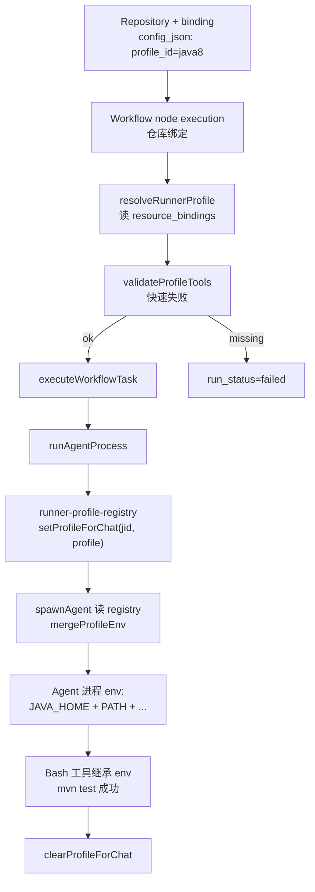

# SDLC Runner Profiles

> 适用范围：Workflow Workbench 的仓库绑定节点执行，以及保留窗口内的旧
> Workteam SDLC pipeline 辅助能力。旧 Workteam 主 CRUD / SDLC run route
> 当前不再作为主线恢复。

## 是什么

Runner Profile 让 SDLC 任务在非 Node.js 项目（Java 8 / Go / Python）上也能跑通。
每个 profile 描述：

- 该语言的**识别标志**（`pom.xml` / `go.mod` / `pyproject.toml` / ...）
- 启动前**必须存在的工具**（`java` / `mvn` / `go` / `python3` / ...）
- Agent 进程的**额外 env**（`PATH` 前置、`JAVA_HOME` 等）
- SDLC "测试验证" 任务的**默认单测命令**
- 用于 eval 的**成功判据**（`required_patterns`）

仓库选一个 profile 后：
1. Workflow 节点执行会读取仓库绑定的 profile；旧 Workteam 的解析与工具校验能力仍存在
2. 正式执行任务时，每个 Agent 进程 spawn 时把 profile 的 env 合并进去
3. Agent 的 Bash 工具（`/bin/sh`）从 PATH 中就能找到对应工具链

## 原理图



## 内置 profile

Phase 1 内置 4 个 profile（Workflow 入口见 `src/workflow/runner-profiles.ts`，
底层复用旧 `src/workteam/runner-profiles.ts` 的 `BUILTIN_PROFILES`）：

- **nodejs** — `package.json` → 要求 `node`、`npm`；测试命令 `npm test`
- **java8** — `pom.xml` / `build.gradle` → 要求 `java`；测试命令 `mvn test`；env 透传 `JAVA_HOME`、`MAVEN_HOME`、`M2_HOME`、`GRADLE_HOME`
- **go** — `go.mod` → 要求 `go`；测试命令 `go test ./...`；env 透传 `GOPATH`、`GOROOT`、`GOPROXY`、`GO111MODULE`
- **python** — `pyproject.toml` / `requirements.txt` / `setup.py` / `Pipfile` → 要求 `python3`；测试命令 `pytest || python3 -m unittest discover`；env 透传 `PYTHONPATH`、`VIRTUAL_ENV`、`POETRY_HOME`

## 物理部署（生产默认）

Runner 进程跑在 NanoClaw 宿主上，profile 仅控制 env 注入，不负责安装工具。
所以宿主必须先装好所需工具链（以常见布局为例）：

```bash
# Java 8
sudo apt install openjdk-8-jdk maven
echo 'export JAVA_HOME=/usr/lib/jvm/java-8-openjdk-amd64' >> ~/.bashrc
echo 'export PATH="$JAVA_HOME/bin:$PATH"' >> ~/.bashrc

# Go
sudo apt install golang-go
# 或从官方发行版解压到 /opt/go，然后 export PATH=/opt/go/bin:$PATH

# Python 3
sudo apt install python3 python3-pip
pip install pytest
```

上面几个 env 都在 profile 的 `extraPassthrough` 白名单里，NanoClaw 启动时会把
宿主的 `JAVA_HOME` / `GOPATH` 等透传进 Agent 进程。

## 使用方式

### 1. 为仓库绑定 profile

```bash
# 显式指定
curl -X POST .../api/workflows/repositories/<repoId>/runner-profile \
  -H 'Content-Type: application/json' \
  -d '{"profile_id": "java8"}'

# 自动探测（按仓库根下标志文件）
curl -X POST .../api/workflows/repositories/<repoId>/runner-profile \
  -H 'Content-Type: application/json' \
  -d '{"profile_id": "auto"}'
```

`auto` 会调 `detectProfilesForWorktree`，要求仓库记录里 `local_repo_path`
已配置并且本地已 clone。

### 2. 查看 / 清除绑定

```bash
curl .../api/workflows/repositories/<repoId>/runner-profile
# { "profile_id": "java8" }

curl -X DELETE .../api/workflows/repositories/<repoId>/runner-profile
```

### 3. 列出内置 profile

```bash
curl .../api/workflows/runner-profiles
```

### 4. 启动 Workflow run

Workflow run 会在 `executeWorkflowTask` 中：
- 读 workflow 的仓库绑定 → 解析 repository runner profile
- 使用节点 `allowedDirectories`，或 workflow 仓库绑定目录，或 assistant 仓库目录作为可访问目录
- 把 profile 注册到 agent spawn registry，随后 `spawnAgent` 合并 profile env

旧 Workteam 的 runner profile support routes 暂时保留为兼容入口，但新 UI 已切到
`/api/workflows/**`。

## 工具缺失错误示例

```
Runner profile "java8" requires `java`, but it is not available on PATH.
Install OpenJDK 8 and Maven (or Gradle). Set JAVA_HOME to the JDK root
and ensure `java` and `mvn` / `./gradlew` are on PATH.
```

消息由 `formatMissingToolsError` 生成，可以直接粘到运维脚本里排查。

## 自定义 profile（Phase 2 预告，当前未实现）

要新增 `java17`、`python3.12` 等，Phase 2 会开放 DB 存储。目前若需要自定义：
1. 在 `BUILTIN_PROFILES` 数组里补一个常量（改代码）
2. 确保 `detect.files`、`requiredTools`、`testCommand`、`testSuccessPatterns`
   四项都填好
3. 如需透传额外的宿主 env，放到 `env.extraPassthrough`
4. 重启 NanoClaw 生效

## 已知限制

- Phase 1 只支持**仓库级**绑定；任务级 profile 覆写未暴露
- 不做**自动 provisioning**（mise/asdf/sdkman），只做 env 注入
- **Docker 镜像 matrix** 未做；`Dockerfile` 最终镜像不带 JDK/Go/Python 运行时
- `auto` 模式必须有 `local_repo_path` 才能 detect；远端仓库尚未拉到本地时返回
  undefined（不注入 env，退化为现有行为）

## 相关代码

- `src/workflow/runner-profiles.ts` — Workflow 侧 runner profile 入口 / 兼容导出
- `src/workflow/runner-profile-registry.ts` — Workflow 侧 registry 入口 / 兼容导出
- `src/workteam/runner-profiles.ts` — 类型 + `BUILTIN_PROFILES` + 合并 / 校验
- `src/workteam/project-detector.ts` — 按标志文件探测
- `src/workteam/runner-profile-registry.ts` — `chatJid → profile` 内存映射
- `src/workteam/runner-profile-resolver.ts` — 绑定读写 + 解析
- `src/agent/agent-runner-spawn.ts` — 在 `spawnAgent` 处读 Workflow registry 并合并 env
- `src/workflow/agent-adapter.ts` — Workflow 节点前注册、结束/异常清理
- `src/workteam/agent-adapter.ts` — 任务前注册、结束/异常清理
- `src/workteam/orchestrator.ts` — `startRun` 前 `validateProfileTools`
- `src/routes/workflow-routes.ts` — Workflow runner profile API 端点
- `src/routes/workteam-routes.ts` — 兼容期 Workteam support API 端点
- 单测：`runner-profiles.test.ts`、`project-detector.test.ts`、`runner-profile-registry.test.ts`
