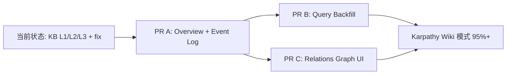
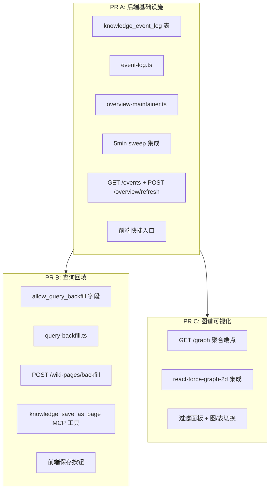
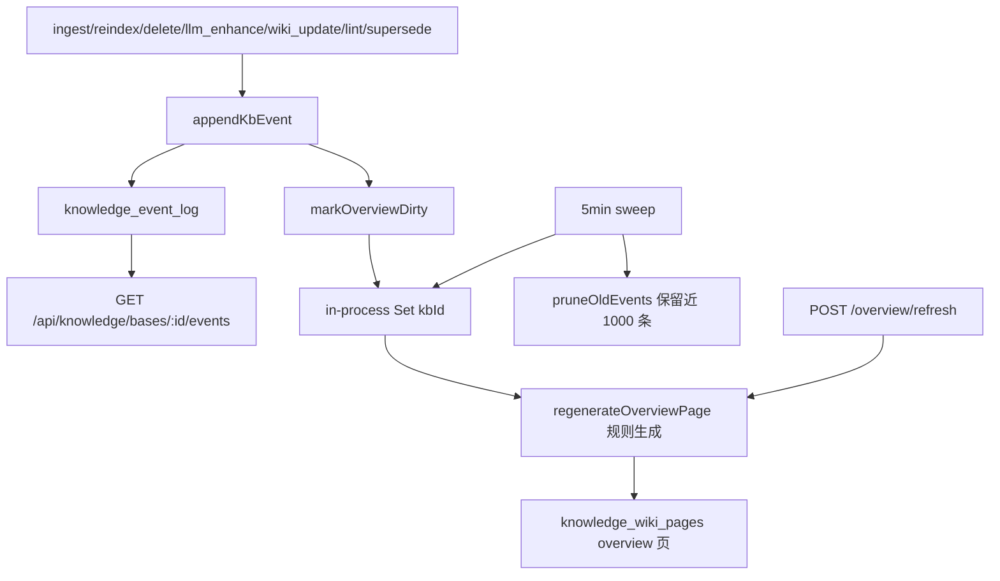
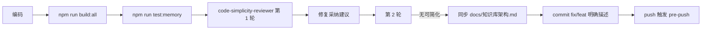

# 知识库 LLM Wiki 模式进阶 Plan（PR A + PR B + PR C）

> **目的**：在已落地的 KB 增强 L1/L2/L3 与本次 fix（feat/kb-enhancement-fixes）基础上，按 Karpathy "LLM Wiki" 模式补足 4 项进阶能力。

## 背景

当前知识库已经实现：

- L1 元数据增强（`published_at`、`doc_path`、`superseded_by`、时序衰减加权、兄弟加权）
- L2 LLM 增强（摘要、实体、关联检测，支持嵌入候选筛选）
- L3 Wiki 维护（实体页/概念页/综合页、交叉引用、`lintWiki` 健康检查）
- 后台任务（5 分钟 LLM 状态恢复 + 孤儿父链重算）
- 检索增强（Wiki staleness 降级 ×0.5、多 KB 半衰期分别加权、单文档 flight 锁）

对照 Karpathy 提出的 LLM Wiki 模式，仍有 4 项缺口：

| 能力 | 缺口 |
|------|------|
| `index.md` 入口页 | 无系统维护的"知识库总目录"页 |
| `log.md` 事件流 | 仅有 `llm_status` 状态字段，无可追溯的事件时间线 |
| 查询结果回填 | 一次综合查询的答案消失在聊天历史，不沉淀 |
| 图谱视图 | 关联仅以表格呈现，没有 Obsidian 风格的 graph view |

本 plan 用 **3 个独立 PR** 收口：PR A 是基础设施（其余 PR 依赖），PR B/C 与 PR A 串行或并行均可。

## 总体路线





---

## PR A：Overview 索引页 + Event Log（本次执行）

### 目标

对齐 Karpathy 的 `index.md` 与 `log.md` 概念。`index.md` 是 LLM 在回答前先读的入口，`log.md` 是 KB 演化时间线。两者都属于"wiki 元信息维护"，共用后台调度，因此合并为一个 PR。

### 数据模型

#### 新增表 `knowledge_event_log`

| 字段 | 类型 | 约束 | 说明 |
|------|------|------|------|
| `id` | VARCHAR(64) | PK | nanoid |
| `kb_id` | VARCHAR(64) | NOT NULL | 所属 KB（无物理 FK） |
| `event_type` | VARCHAR(32) | NOT NULL | `ingest` / `reindex` / `delete` / `llm_enhance` / `wiki_update` / `lint` / `query_backfill` / `supersede` |
| `doc_id` | VARCHAR(64) | NULL | 涉及的文档 ID |
| `page_id` | VARCHAR(64) | NULL | 涉及的 wiki 页面 ID |
| `title` | VARCHAR(255) | NOT NULL | 一行摘要 |
| `payload` | TEXT | NULL | 可选 JSON 载荷 |
| `created_at` | VARCHAR(32) | NOT NULL | ISO 8601 |
| `created_by` | VARCHAR(64) | NOT NULL | 触发用户（系统任务用 `__system__`） |

索引：

- `(kb_id, created_at DESC)` — "最近 N 条"主查询
- `(kb_id, event_type, created_at DESC)` — 按类型过滤

#### 复用 `knowledge_wiki_pages`

- Overview 页用 `page_type='overview'`，每个 KB 至多一条
- 标题固定 `知识库索引`，内容是规则化生成的 markdown（不调 LLM，避免成本失控）
- 应用层保证唯一性（`updateOrCreatePageByTypeAndKb`），三方言无需新约束

### 实现链路



### 文件改动

#### 新增

- `src/knowledge/event-log.ts`（约 80 行）
  - `appendKbEvent({kbId, eventType, docId?, pageId?, title, payload?})`
  - `listRecentEvents(kbId, limit)`
  - `pruneOldEvents(kbId, keepRecent)`
  - 内部维护 `dirtyOverviewKbs: Set<string>`（导出 `markOverviewDirty` / `consumeDirtyOverviews`）
  - 失败必须静默：附属设施不能让主流程崩

- `src/knowledge/overview-maintainer.ts`（约 120 行）
  - `regenerateOverviewPage(kbId)`：从 `knowledge_wiki_pages` 拉全部页面 + `listRecentEvents(kbId, 20)` 拼成 markdown，update/insert 到 `page_type='overview'`，递增 version，更新 FTS
  - `regenerateAllDirtyOverviews()`：消费 `dirtyOverviewKbs` 调度

#### 修改

- `src/db/schema-sqlite.ts` / `schema-mysql.ts` / `schema-postgres.ts`：在迁移段尾追加 `CREATE TABLE IF NOT EXISTS knowledge_event_log` + 两个索引（不动既有迁移行，避免冲突）

- `src/index.ts` 5 分钟 sweep 追加：

  ```ts
  await regenerateAllDirtyOverviews();
  await pruneAllEventLogs();
  ```

- 事件写入 hook（**全部 fire-and-forget，绝不 await 主流程**）：

  | 位置 | event_type |
  |------|-----------|
  | `src/knowledge/pipeline.ts` indexDocument success | `ingest` |
  | `src/knowledge/pipeline.ts` reindexDocument success | `reindex` |
  | `src/routes/knowledge-routes.ts` DELETE document | `delete` |
  | `src/knowledge/pipeline.ts` runLlmEnhancementChain L2 done | `llm_enhance` |
  | `src/knowledge/wiki-maintainer.ts` updateOrCreateWikiPages 每页 | `wiki_update` |
  | `src/knowledge/wiki-maintainer.ts` lintWiki | `lint` |
  | `src/knowledge/metadata-extractor.ts` markSuperseded | `supersede` |

  统一用一个微型装饰器避免散写：

  ```ts
  function safeAppend(...args) { void appendKbEvent(...args).catch(() => {}); }
  ```

- `src/routes/knowledge-routes.ts` 新增：

  | 方法 | 路径 | 权限 | 说明 |
  |------|------|------|------|
  | GET | `/api/knowledge/bases/:id/events?limit=50&type=ingest` | knowledge.view | 返回事件流 |
  | POST | `/api/knowledge/bases/:id/overview/refresh` | assistant.manage | 强制重建 |

- `web/src/pages/KnowledgePage.tsx`：在 wiki Tab 顶部加一个「知识库索引」快捷入口卡片（点击直接定位到 overview 页）。**不新增独立 Tab**

- `docs/知识库架构.md`：补充事件流、overview 自动维护小节

### Markdown 输出样例

Overview 页内容（示意）：

```markdown
# 知识库索引

最近更新：2026-04-17

## 综合页面
- [知识库综合](wiki://<page_id>) — 12 篇源文档

## 实体页面（14）
- [Kubernetes](wiki://...) — 5 篇源文档，v3
- [Docker](wiki://...) — 3 篇源文档，v2
...

## 概念页面（8）
- [容器编排](wiki://...) — 6 篇源文档，v4
...

## 近期事件（最近 20 条）
- `[2026-04-17]` ingest | K8s 滚动更新实践 v2
- `[2026-04-16]` wiki_update | Kubernetes (v3)
- `[2026-04-15]` supersede | Docker 基础教程 → Docker 基础教程 v2
```

### 三条验证 Case

**Case 1**：向 KB 入库 3 个文档

- 预期：`knowledge_event_log` 3 条 `ingest` 事件；5 分钟 sweep 后 overview 页面包含这 3 篇在"近期事件"段落

**Case 2**：对 `wiki_full` KB 调用 `lintWiki` API

- 预期：`knowledge_event_log` 1 条 `lint` 事件；overview 页 dirty 被设置；下次 sweep 后页面更新

**Case 3**：调用 `POST /overview/refresh`

- 预期：立即重建 overview 页，version+1；sweep dirty 集合不重复处理

### 工作量

约 390 行（80 event-log + 120 overview-maintainer + 60 schema × 3 + 50 路由 + 30 hook + 20 sweep + 30 前端）

---

## PR B：查询结果回填 Wiki（后续）

### 目标

让"探索的成果不消失在聊天历史里"。Agent / 用户发起一次 `knowledge_search`，可以把综合答案存为 wiki 页，下次直接命中。

### 关键设计

- 新字段 `knowledge_bases.allow_query_backfill BOOLEAN DEFAULT 0`（默认关闭防滥用）
- 独立端点 `POST /api/knowledge/bases/:id/wiki-pages/backfill`（不污染 `/search` 的纯读语义）
- 新 MCP 工具 `knowledge_save_as_page`，沿用 `NANOCLAW_AVAILABLE_KB_IDS` 白名单
- 限速：`(userId, kbId)` 每分钟 5 次（进程内 token bucket）
- Wiki 页类型用 `page_type='comparison'`，区分自动生成的 `synthesis`

### 工作量

约 420 行

---

## PR C：关联图可视化（后续）

### 目标

把当前「关联」Tab 的表格升级为 Obsidian 风格力导向图。

### 关键设计

- 库选型：`react-force-graph-2d`（React 集成 + Canvas 性能 + 150KB gzip 可接受）
- 后端聚合端点 `GET /api/knowledge/bases/:id/graph` 一次返回 `{nodes, links}`
- 边类型：`parent_of`（实蓝） / `supersedes`（粗红） / `supplements` / `contradicts` / `references`（虚色）
- 性能降级：>500 节点时只渲染 confidence ≥ 0.7 的边
- 表/图切换器保留，图视图为默认
- 深色主题用 CSS 变量适配，不硬编码 hex

### 工作量

约 410 行

---

## 共用执行 checklist

每个 PR 走同样的流程：



每个 PR 必须满足：

- `npm run build:all` 0 errors
- `npm run test:memory` 全过
- code-simplicity-reviewer 收敛 "无可简化处"
- `docs/知识库架构.md` 同步
- commit message 包含 3 条验证 case 预期

## 不在范围（YAGNI 边界）

- 多语言 wiki 页面
- Wiki 版本回滚（version 仅递增）
- Event log 的管理 UI（MVP 仅 API）
- 实时协作编辑

## 与 Karpathy LLM Wiki 模式对齐

| 能力 | 当前 | PR A | PR B | PR C | 最终 |
|------|------|------|------|------|------|
| 持久化累积 wiki | done | | | | done |
| Ingest 增量维护 | done | | | | done |
| 实体/概念/综合页 | done | | | | done |
| 交叉引用 | done | | | | done |
| Lint 健康检查 | done | | | | done |
| `index.md` 入口页 | 无 | done | | | done |
| `log.md` 事件流 | 无 | done | | | done |
| 查询结果回填 | 无 | | done | | done |
| Obsidian 图谱视图 | 表格 | | | done | done |

对齐度：80% → 95%+
