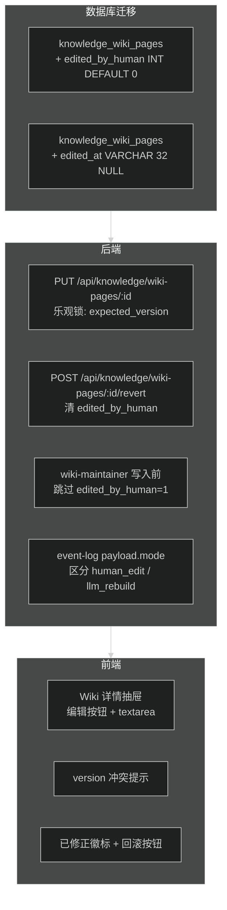
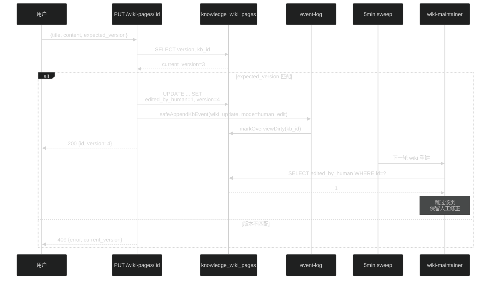

# Wiki 页人工修正 Plan（PR Q-Edit）

> **目的**：对齐 Karpathy "LLM Wiki" 模式中"human + agent 共同增量维护"的对称性——今天 agent 能写、能改 wiki 页，而人只能"触发重建"，形成一条漏斗；本 plan 补足人工直接修正 wiki 页的能力，并保证下一轮 LLM 刷新不会悄悄覆盖人工修正。

## 背景

当前知识库状态（PR F/H/A/P 合入后）：

- L1 / L2 / L3 三层增强、overview 索引页、event log、关联图、查询回填、agent MCP 都已就绪
- 对照 Karpathy 模式的功能对齐度 ≈ 95%+
- Wiki 页由 LLM 自动产出、lint 维护，**没有**人工直接编辑的口子

缺口：

| 场景 | 当前行为 | 期望行为 |
|------|---------|---------|
| LLM 把实体页错写成同义概念 | 只能 `reclean` → `llm-process` 全链重跑（耗 token 耗时） | 直接编辑保存 |
| Wiki 页某段事实需要局部修改 | 无法局部修改 | 直接编辑 |
| 人工改完后 LLM 下次 sweep 是否覆盖 | 会覆盖 | 不覆盖（带"已修正"标记） |
| 需要回滚人工编辑 | 无 | 取消"已修正"标记，下次 LLM 刷新恢复 |

该 PR 只做**一个**独立的小范围 feature，不触动 L1/L2/L3 主流水线，走最小改动。

## 总体路线




---

## 数据模型

### `knowledge_wiki_pages` 加两列（三方言同构）

| 字段 | 类型 | 默认 | 说明 |
|------|------|-----|------|
| `edited_by_human` | INT（SQLite/PG）/ TINYINT（MySQL） | 0 | 1 表示人工改过；LLM 刷新跳过 |
| `edited_at` | VARCHAR(32) | NULL | 最近一次人工编辑的 ISO 时间戳；`revert` 后 NULL |

迁移策略沿用既有约定：

- **SQLite**：`try { ALTER TABLE ... ADD COLUMN ... } catch {}`
- **MySQL**：`safeMigrate`（借 PR F 的 `isDuplicateObjectError` 白名单）
- **PostgreSQL**：`ADD COLUMN IF NOT EXISTS`

**不**新增表、**不**加索引：这两列不作为查询条件，只在 update/read 单页时用，没必要索引。

### 不变更

- `version` 字段继续作为乐观锁（LLM 刷新和人工编辑都会 +1）
- `updated_at` 字段继续记录任意写入时间
- `llm_model` 字段人工编辑时写 `'human'` 做简单标识（比加一个 `editor` 列省）

## API 契约

### `PUT /api/knowledge/wiki-pages/:id` — 更新单页内容

请求体：

```json
{
  "title": "Kubernetes",
  "content": "# Kubernetes\n\n...",
  "expected_version": 3
}
```

响应：

| 状态 | 场景 |
|------|------|
| 200 | 更新成功，返回新 `{ id, version, updated_at }` |
| 400 | 字段校验失败（`title` 空 / `content` 超 512 KB） |
| 404 | 页不存在 / 对调用者不可见 |
| 409 | `expected_version != current_version`（并发冲突），响应体 `{ error, current_version }` |
| 413 | `content` 超长 |

行为：

- 成功后：`edited_by_human = 1`、`edited_at = now`、`version += 1`、`llm_model = 'human'`、更新 FTS search vector
- `safeAppendKbEvent({ eventType: 'wiki_update', payload: { mode: 'human_edit' } })`
- `markOverviewDirty(kbId)` —— 索引页会在 5 分钟 sweep 后刷新摘要

### `POST /api/knowledge/wiki-pages/:id/revert` — 取消人工修正标记

- 不还原内容（不做历史版本），只 `edited_by_human = 0`、`edited_at = NULL`
- 下一轮 `llm-process` / `lint` 会重新覆盖该页
- 响应 200 返回 `{ id, edited_by_human: 0 }`

### 权限

- 沿用 `editGuard`（`assistant.manage` + `knowledge.edit` / `knowledge.create`）
- 通过 KB 可见性校验（`isKbVisibleToUser` + `kb.user_id === userId` 或 `SYSTEM_USER_ID`）

## 实现链路



## 文件改动

### 修改

| 文件 | 改动 | 预计行数 |
|------|------|---------|
| `src/db/schema-sqlite.ts` | 迁移段追加两列 `ADD COLUMN` | +6 |
| `src/db/schema-mysql.ts` | `safeMigrate` 追加两列 | +8 |
| `src/db/schema-postgres.ts` | `ADD COLUMN IF NOT EXISTS` 两列 | +4 |
| `src/knowledge/wiki-maintainer.ts` | `updateOrCreateWikiPages` 在 update 分支前查 `edited_by_human`，为 1 则跳过并 log.debug | +15 |
| `src/routes/knowledge-routes.ts` | 新增两个端点 | +70 |
| `web/src/pages/KnowledgePage.tsx` | Wiki 详情面板：只读 → 可编辑；加"已修正"徽标、"编辑"/"保存"/"取消"/"回滚 LLM 覆盖"按钮 | +80 |
| `web/src/styles/knowledge.css` | 编辑抽屉 + 徽标样式 | +20 |
| `docs/知识库架构.md` | Wiki 页字段表新增两列；新增"人工修正与 LLM 共存"小节 | +25 |

### 新增

无新模块，只在既有文件追加方法/端点。

### 不修改

- `src/knowledge/pipeline.ts`：L2 增强链不经过 wiki 页，不变
- `src/knowledge/llm-enhancer.ts`：不涉及
- `src/knowledge/retrieval.ts`：Wiki FTS 命中不区分人工/LLM，相同对待
- 既有测试文件（新加独立 test 文件）

## 校验策略

### Lint 与人工修正的交互

`lintWiki` 的两类操作：

1. **标记过期（`isStale`）**：不受人工修正影响，仍标记。理由：即使是人改的，源文档变化后它也可能过时，需要让用户看到
2. **重生成（`regeneratePages`）**：`edited_by_human=1` 的页跳过，lint 报告里列出 `skipped_human_edited` 计数

用户预期：点「Wiki 检查」后，看到 lint 报告里明确写 "skipped N pages (human-edited)"，不会惊讶 LLM 偷偷覆盖自己的修改。

### 乐观锁

- 前端打开编辑抽屉时记下 `version`
- 保存时发 `expected_version`
- 409 时前端提示 "该页已被其他人/LLM 更新，请刷新后重试"，不做自动合并（merge 让人决定更可靠）

## 三条验证 Case

**Case 1**：用户编辑 Kubernetes 实体页（version=3）

- 发送 `PUT /wiki-pages/:id` with `expected_version=3`
- 预期：200，DB 行 `edited_by_human=1, edited_at=now, version=4, llm_model='human'`；`knowledge_event_log` 出现 `wiki_update` 事件，`payload.mode='human_edit'`；5 分钟 sweep 后 overview 页一行摘要刷新为新首句

**Case 2**：人工编辑后对该 KB 再次 `lintWiki`

- 预期：lint 报告包含 `skipped_human_edited: ['<page_id>']`（或计数），该页 `content`/`version` 不变；其他非人工编辑的页照常更新

**Case 3**：用户决定放弃人工修正，点"回滚 LLM 覆盖"

- 发送 `POST /wiki-pages/:id/revert`
- 预期：200，DB `edited_by_human=0, edited_at=NULL`；内容**不**立即回退（不做历史版本，YAGNI）；下次 `llm-process` 或 `lint` 会按 LLM 规则重生成该页

## 风险与边界

### 风险

| 风险 | 缓解 |
|------|------|
| 并发编辑同一页 | `expected_version` 乐观锁 + 409 显式提示 |
| content 超长拖慢传输 | 512 KB 上限（query-backfill 是 256 KB，wiki 页略大合理） |
| LLM 和人工同时写入 | LLM 的 `updateOrCreateWikiPages` 先检查 `edited_by_human`，以数据库读后写时序保证 |
| `edited_by_human` 设置后用户忘记回滚 | 前端徽标 + 详情面板顶部醒目提示 "此页已被人工修正，LLM 不再更新" |

### 不在范围（YAGNI）

- **Wiki 版本历史 / 回滚到任意历史版本**：只做"取消 human_edit 标记让 LLM 下次覆盖"，不做 diff / timeline UI
- **多人协作编辑 / 实时冲突合并**：乐观锁 + 用户手动重试足够
- **人工编辑审计流**（谁改的、审批链）：event-log 里 `payload.mode='human_edit'` 已经足够追溯
- **富文本编辑器**：直接 `<textarea>` 编辑 markdown 即可；KISS
- **逐字段 diff / 局部补丁 API**：整页 PUT 足够简单
- **人工改后自动刷新 overview**：交给既有 `markOverviewDirty` + 5min sweep

## 工作量

约 **230 行**（6 schema + 15 wiki-maintainer + 70 routes + 80 前端 + 20 CSS + 25 文档 + 单测约 15 行），预计 **1.5-2 天**。

## 共用执行 checklist

沿用 PR A/B/C/F/H/P 的流程：

```mermaid
%%{init: {'theme':'dark'}}%%
flowchart LR
  Worktree[git worktree add<br/>feat/kb-wiki-edit] --> Code[编码]
  Code --> Build[npm run build]
  Build --> Test[npm run test:memory]
  Test --> Unit[新增 wiki-edit.test.ts]
  Unit --> R1[code-simplicity-reviewer 第 1 轮]
  R1 --> Fix[修复采纳建议]
  Fix --> R2[第 2 轮]
  R2 -->|无可简化| Doc[同步 docs/知识库架构.md]
  Doc --> Commit[commit 带 3 条验证 case 预期]
  Commit --> Push[push 触发 pre-push]
  Push --> Merge[合并到 main]
```



硬性准入：

- `npm run build` 0 errors
- `npm run test:memory` 全过
- 新增 `src/knowledge-wiki-edit.test.ts`（乐观锁 / 权限 / revert / lint 跳过）
- code-simplicity-reviewer 收敛"无可简化处"
- `docs/知识库架构.md` 同步
- commit 包含 3 条验证 case 预期

## 与 Karpathy LLM Wiki 模式对齐

| 能力 | PR F/H/A/P 后 | PR Q-Edit 后 |
|------|--------------|------------|
| 持久化累积 wiki | done | done |
| Ingest 增量维护 | done | done |
| 实体/概念/综合页 | done | done |
| 交叉引用 | done | done |
| Lint 健康检查 | done | done（`skipped_human_edited` 报告） |
| `index.md` 入口页 | done | done（人工修正的摘要会反映到索引） |
| `log.md` 事件流 | done | done（`human_edit` 模式标记） |
| 查询结果回填 | done | done |
| 关联图视图 | done | done |
| **人与 agent 对称维护** | 只有 agent 能写 | **人可直接编辑，LLM 不覆盖** |

对齐度：95%+ → **98%+**

剩余 2% 属于真正的 YAGNI（多语言 / 版本回滚 / 实时协作 / 富文本），除非业务明确要求，不再推进。

---

**执行指南**：用 `git worktree add .worktrees/feat-kb-wiki-edit feat/kb-wiki-edit main` 开干，保持与主 workspace 隔离，遵循与 PR F/H/A/P 相同的 2 轮 code-simplicity-reviewer 流程，最终 fast-forward 合入 main。
