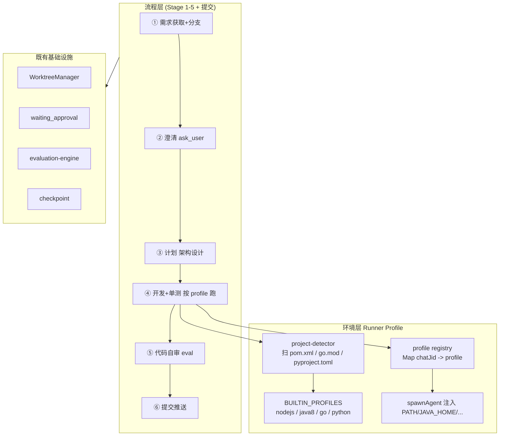

# SDLC Runner Profile 基建 + 流程缺陷修复 (Phase 1)

Created: 2026-04-17
Scope: Workteam SDLC pipeline 多语言执行能力 + 现有流程缺陷修复

## 一、背景

最近几个提交（`2ca8063` / `0954591` / `0949a62` / `e07990b`）给 `src/workteam/` 落地了 SDLC pipeline：DAG 任务编排、审批门（`waiting_approval`）、LLM eval + 重试、checkpoint 持久化、需求解析、worktree 隔离。

但是当 pipeline 要为一个非 Node.js 项目（JRE8 / Go / Python）跑单元测试时，存在两层阻塞：

1. **运行时层**：Agent 的 Bash 工具用 `execSync('/bin/sh')` 继承宿主 PATH；`Dockerfile` 最终镜像只装了 `node/git/bash`，没有 JDK/Go/Python。
2. **模板层**：`sdlc-template.ts` 的任务描述语言无关，"测试验证"任务没说具体跑什么命令，Agent 只能靠猜。

另外，对标文章《从 Vibe Coding 到 Agentic Engineering》的 11 阶段梳理发现 5 处既有缺陷（详见本文第五节）。

## 二、目标

- **环境**：让 SDLC pipeline 能针对 Node / Java8 / Go / Python 四种语言自动生成正确的单测命令 + 注入对应的 `PATH` / `JAVA_HOME` / `GOROOT` 等 env。
- **流程**：补齐文章流程中「需求 → 澄清 → 计划 → 开发+单测 → 自审 → 提交」这段；MR/CR/CI/部署 留给 Phase 2+。
- **现有缺陷**：一并修复探索发现的 B1-B5 五处缺陷，避免蓝图建在沙子上。

## 三、架构



### 核心设计决策

- **Profile 数据来源**：Phase 1 只有 **4 个内置 profile 常量**（nodejs / java8 / go / python），未来若需要扩展（java17 / python3.12）走 DB 存储。
- **工具缺失策略**：**快速失败**。`validateProfileTools` 在 run 启动前检查 `required_tools`，任何一个宿主缺失就直接 `run_status='failed'` 并给出明确提示（工具名 + 建议的安装 hint）。
- **Profile 粒度**：仓库级默认 + 任务级覆写预留。Phase 1 实现仓库级；任务级通过 `WorkteamTaskRecord.tools_config` 后续扩展。
- **Profile 分发机制**：**per-chatJid 内存 registry**（`runner-profile-registry.ts`）。
  - 每个 workteam 任务的 chatJid 全局唯一（`web:workteam-{teamId}-{agentId}-{taskId}`）。
  - Orchestrator 在调用 `executeAgentTask` 前 `setProfileForChat(chatJid, profile)`。
  - `spawnAgent` 读取 `getProfileForChat(input.chatJid)` 并合并 env。
  - 任务结束/超时/cancel 后 `clearProfileForChat`。
  - 选这种方式是因为修改 `handleWebInput → handleInboundMessage → runAgentProcess → spawnAgent` 整条链路的签名改动面过大，违反"最小化修改"原则。

### Profile 数据模型

```typescript
interface RunnerProfile {
  id: 'nodejs' | 'java8' | 'go' | 'python' | string;
  name: string;
  description: string;
  detect: { files: string[]; priority: number };
  env: {
    pathPrepend?: string[];      // 这些目录前置到 PATH
    extra?: Record<string, string>; // JAVA_HOME, GOROOT, PYTHONPATH 等
    extraPassthrough?: string[]; // 从宿主透传的额外 key
  };
  requiredTools: string[];       // 启动前必须存在的 CLI
  testCommand: string;           // 单测默认命令
  testSuccessPatterns: string[]; // 用于 required_patterns
  toolHint?: string;             // 缺失时的建议文案
}
```

### 仓库级绑定

复用现有 `resource_bindings` 表，新增一条 `binding_key='runner_profile'` 的绑定。`config_json` 存 `{ profile_id: 'java8' | ... | 'auto' }`。

API：`POST /api/workteam/repositories/:id/runner-profile` body `{ profile_id }`。

读取：Orchestrator 在 `startRun` 前调 `resolveRunnerProfile(repoId)`：
1. 如果 `binding.profile_id === 'auto'` → 调 `detectProfilesForWorktree` 取最高优先级
2. 否则按 `profile_id` 查 `BUILTIN_PROFILES`
3. 未绑定且无 worktree → 返回 `undefined`（跳过 profile 注入，退化为当前行为）

### SDLC 模板适配

`buildSdlcTemplate` 新增 `runnerProfile` 选项：
- 如果传入，"测试验证"任务的 description 会含 `命令: ${profile.testCommand}`
- `getSdlcEvalConfigs` 里"测试验证"的 `required_patterns` 注入 `profile.testSuccessPatterns`

## 四、Phase 1 文件清单

**新增**
- `src/workteam/runner-profiles.ts` — 类型、`BUILTIN_PROFILES`、`mergeProfileEnv`、`validateProfileTools`、`findProfileById`
- `src/workteam/project-detector.ts` — `detectProfilesForWorktree`
- `src/workteam/runner-profile-registry.ts` — 进程内 `Map<chatJid, RunnerProfile>`
- `src/workteam/runner-profiles.test.ts`
- `src/workteam/project-detector.test.ts`
- `src/workteam/runner-profile-registry.test.ts`
- `docs/sdlc-runner-profiles.md`

**修改**
- `src/agent-runner-spawn.ts` — 在 env 组装阶段查 registry，合并 profile 的 `pathPrepend` / `extra` / `extraPassthrough`
- `src/workteam/agent-adapter.ts` — `executeAgentTask(agent, task, context, signal, profile?)` 新增 profile 参数；调用前 `setProfileForChat`，结束后 `clearProfileForChat`
- `src/workteam/orchestrator.ts` — 新增 `runnerProfile?: RunnerProfile` 字段、`startRun` 里 `validateProfileTools`、`executeTask` 里透传 profile；checkpoint 里持久化 `runnerProfileId`
- `src/workteam/sdlc-template.ts` — `SdlcTemplateOptions.runnerProfile` + 测试命令动态生成 + `required_patterns` 注入
- `src/routes/workteam-routes.ts` —
  - `POST /workteam/sdlc-create`：新增 `parallel_modules` body 字段（修 B5）
  - `POST /workteam/:id/run`：新增 `uploadedFiles` / `chatUploadsRoot` 支持并调用 `buildSdlcInput`（修 B1）
  - 新增 `POST /workteam/repositories/:id/runner-profile`
- `web/src/pages/WorkteamPage.tsx` — `TaskUiStatus` 补 `waiting_approval`（修 B2）；`deriveTaskStates` 识别 `user_intervention` 事件（修 B3）；`TaskStatusPill` 新增 Approve/Reject 按钮（修 B4）
- `docs/系统概览.md` — Workteam 章节补 Runner Profile
- `README.md` — 能力列表提多语言 SDLC

## 五、现有缺陷（探索发现）

| # | 缺陷 | 位置 | 修复 |
|---|---|---|---|
| B1 | `buildSdlcInput` 无 caller | `src/workteam/sdlc-trigger.ts` | `POST /workteam/:id/run` 里接入 |
| B2 | `TaskUiStatus` 缺 `waiting_approval` | `web/src/pages/WorkteamPage.tsx` | 枚举补齐 |
| B3 | `deriveTaskStates` 未处理 `user_intervention` | 同上 | switch case 增加 |
| B4 | 前端无 Approve/Reject 按钮 | 同上 | `TaskStatusPill` 增加 |
| B5 | `sdlc-create` 未暴露 `parallelModules` | `src/routes/workteam-routes.ts` | body 接收并透传 |

## 六、三个自检 case

### Case 1：Java 8 Maven 项目

- **前置**：repo worktree 含 `pom.xml`；绑定 `profile_id: 'java8'`；宿主装了 `/opt/jdk8`、`mvn`
- **startRun**：`resolveRunnerProfile` 返回 `java8` profile → `validateProfileTools` 检查 `java`/`mvn` 都存在 → 通过
- **executeTask**：orchestrator 把 profile 设到 registry → agent-adapter 触发 spawn → spawnAgent 注入 `JAVA_HOME=/opt/jdk8`、`PATH=/opt/jdk8/bin:$PATH`
- **测试验证任务**：prompt 包含 "命令: mvn test"；Agent 跑 `mvn test`，输出 "Tests passed" → `testSuccessPatterns` 匹配
- **预期**：任务成功，eval 通过

### Case 2：纯 Go 项目（无绑定，自动探测）

- **前置**：worktree 只有 `go.mod`；repo 绑定 `profile_id: 'auto'`；宿主装了 `go`
- **startRun**：`resolveRunnerProfile` → `detectProfilesForWorktree` 返回 `[go]` → 取 `go` profile
- **executeTask**：spawnAgent 注入 `GOPATH` 等（如果 profile 声明）；PATH 无需改
- **测试验证任务**：prompt 含 "命令: go test ./..."；Agent 执行后输出 `PASS` → 匹配 `testSuccessPatterns: ['PASS', 'ok  \t']`
- **预期**：任务成功

### Case 3：工具缺失

- **前置**：repo 绑定 `profile_id: 'java8'`，但宿主 `java` 不在 PATH 里
- **startRun**：`validateProfileTools(java8Profile)` 返回 `{ ok: false, missing: ['java'] }`
- **结果**：`startRun` 抛 `Error(\`Runner profile java8 requires tool 'java' which is not available in PATH. Hint: ${toolHint}\`)`；路由返回 500；run 不会被 DB 持久化为 `running` 状态

## 七、Out of scope（Phase 2+）

- MR/PR 创建（需 GitHub/GitLab MCP 或等效）
- AI 评审（对 MR 评论做行级定位）
- 修复评审意见闭环
- CI 状态门
- 部署/日志排查
- 自动 provisioning（mise/asdf/sdkman）
- Docker 多语言镜像 matrix
- brainstorming/writing-plans 产物落盘到 `docs/`
- 规范 commit 子任务（Conventional Commits 校验）

## 八、验证策略

1. 单元测试：三个新模块均有对应 `.test.ts`，覆盖 detect / merge env / validate / registry 生命周期
2. 集成测试：在 sdlc-template 上补一个轻量测试，验证 profile 传入后模板里命令正确
3. 构建：`npm run build:all`
4. 目标：不破坏既有 `npm run test:memory` 等 critical 测试
