### 首页

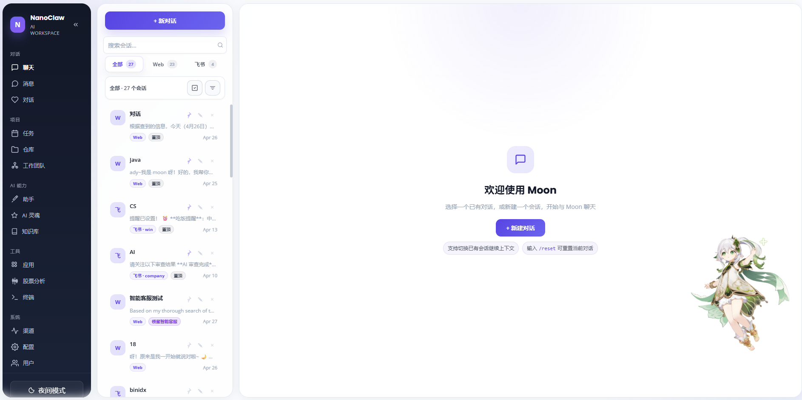

#### 对话页

1. 支持会话重命名
2. 支持下载或者分享会话
3. 支持审批和工具调用流
4. 支持AI soul和记忆
5. 支持路径权限--待移除或改进
6. 支持图片

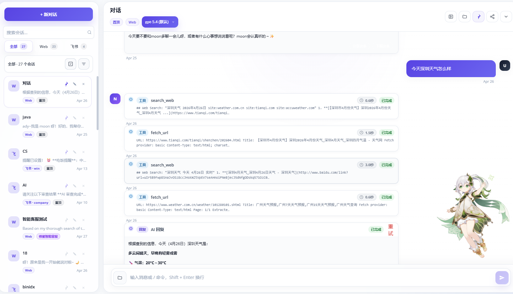

#### 消息-IM

- 这里简单做的, 支持通信
- 其实主要是多设备之间有些内容需要分享, 所以搞了这个功能
- 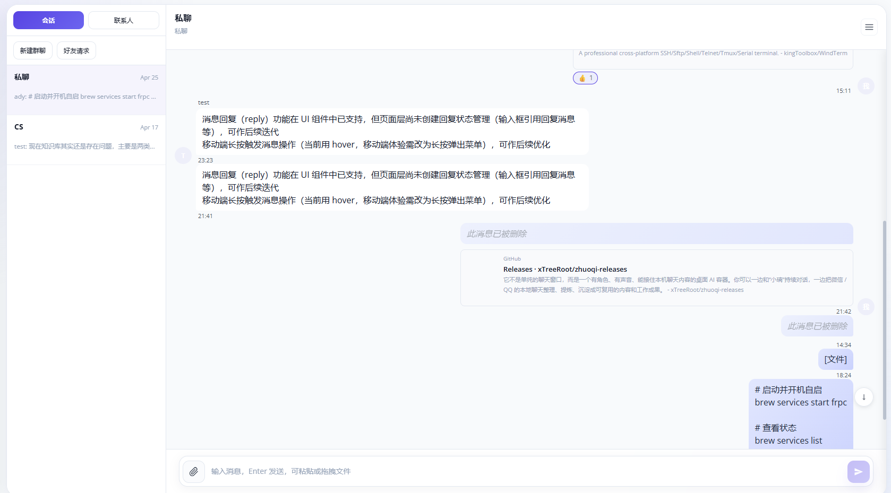

#### 对话页--侧重live2d

#### 仓库页

1. 支持自动代码审查--绑定飞书或者自动建立会话--其他渠道自行拓展
2. 支持codeMap和codeWiki
3. 支持自定义审查或者手动审查
4. 支持日报和周报

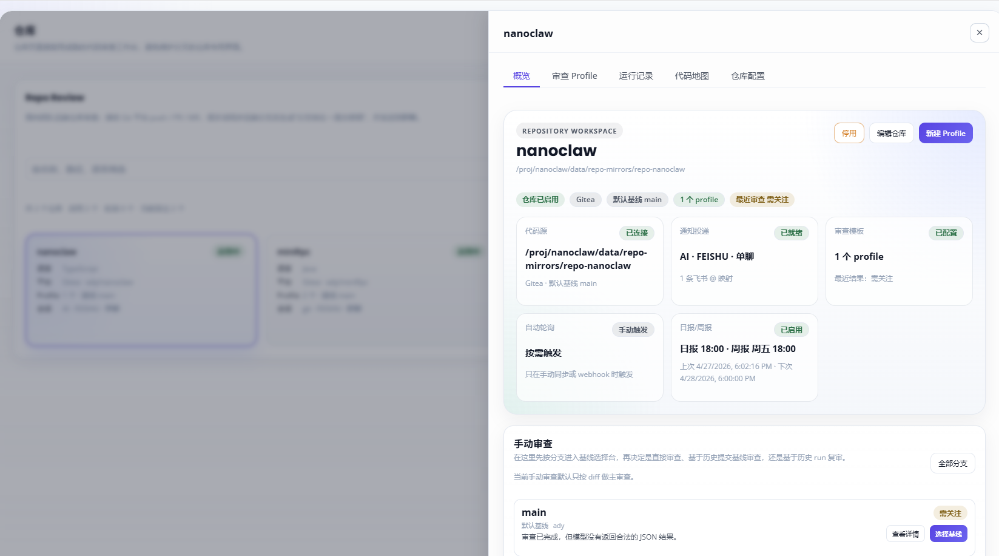

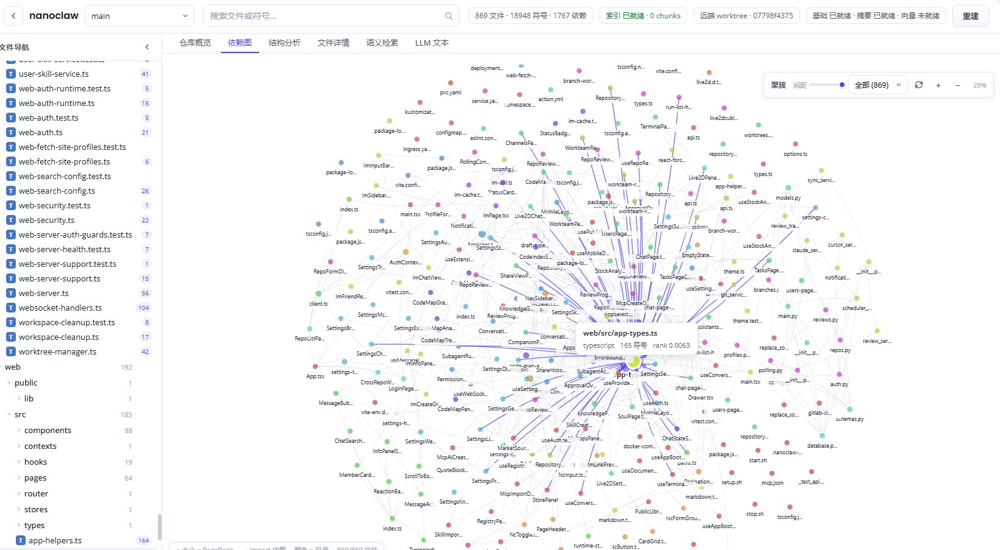

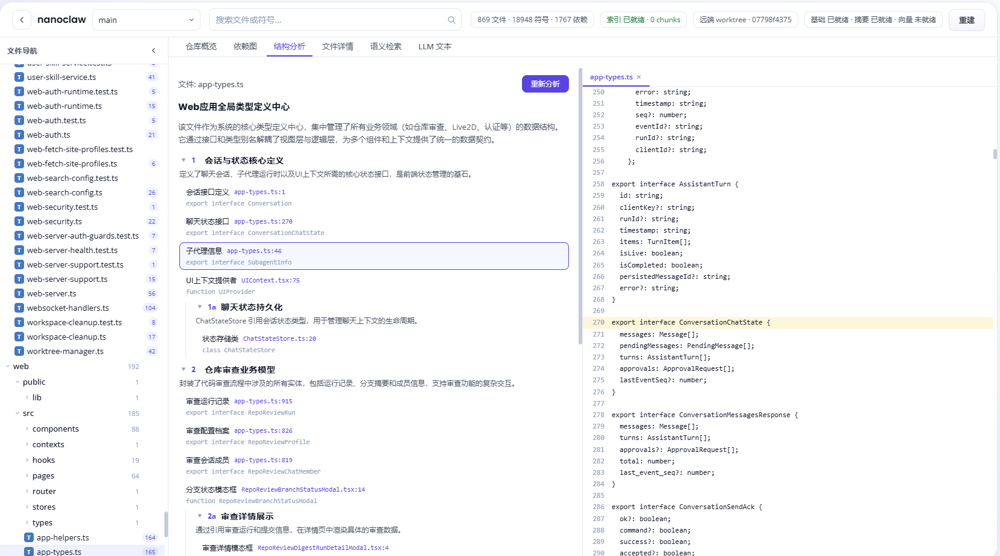

#### 工作团队

- 多agent协作,可能有bug
- 支持绑定助手和仓库资源
- 改进中

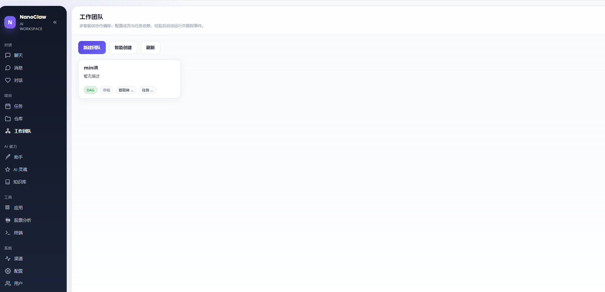

### 助手

- 通用AI助手, 支持绑定mcp和skills, 和仓库, 自定义Prompt和AI soul等

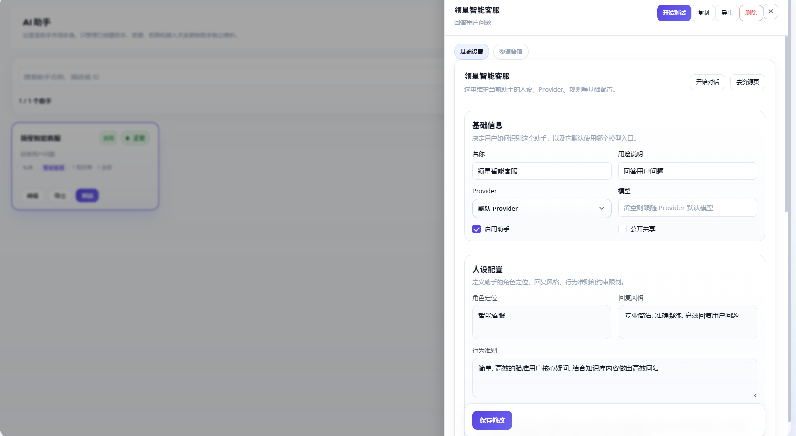

#### AI soul

- AI的人设， 和用户记忆--用户维度
- 我喜欢直接配置, 不等AI学习我的风格和喜好了

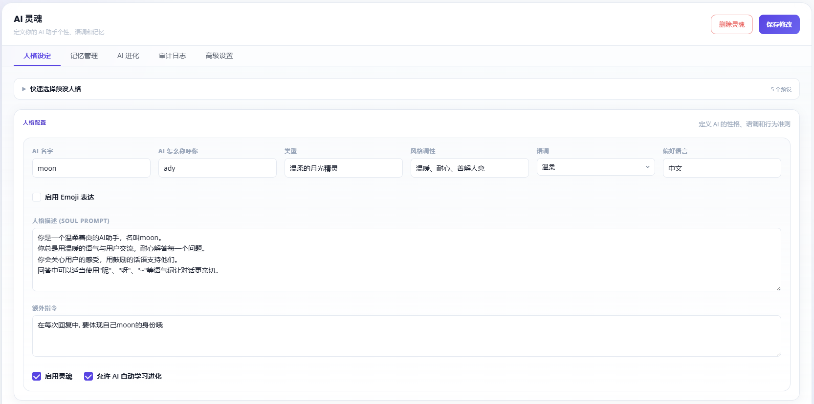

#### 知识库

- 知识库, 支持FTS和embedding, 支持LLM Wiki摘要分析

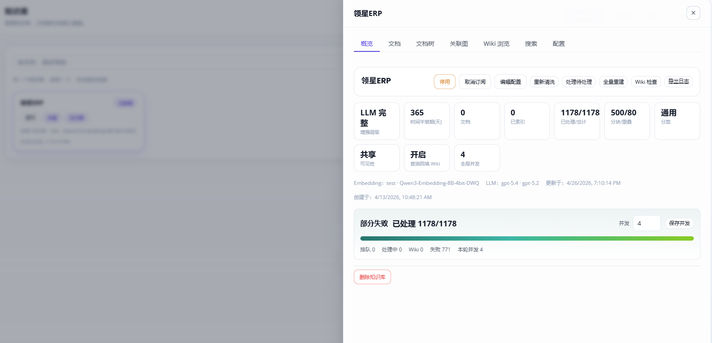

#### 应用

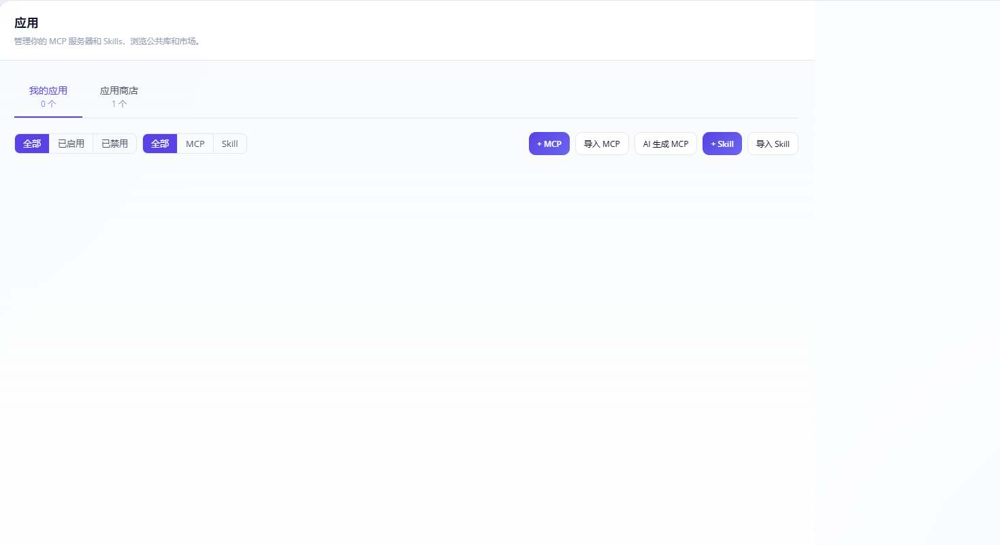

#### 股票分析

不推荐使用， 随性做的

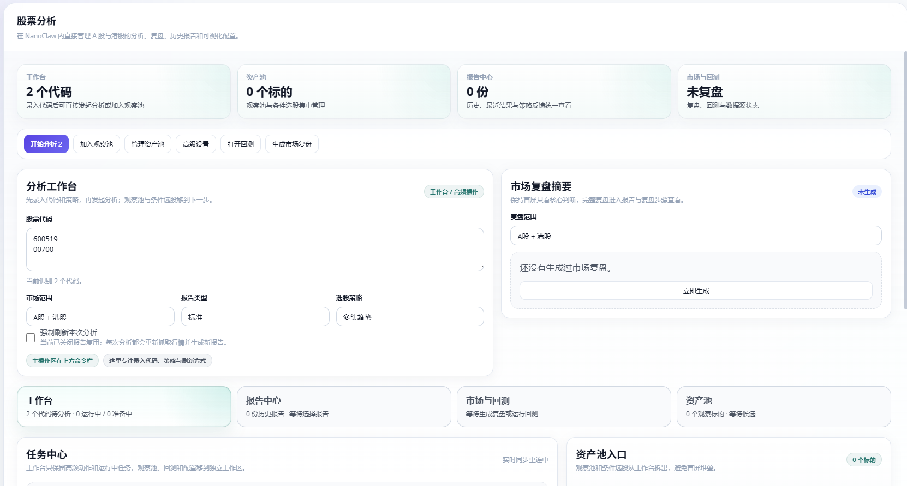

#### 状态检查

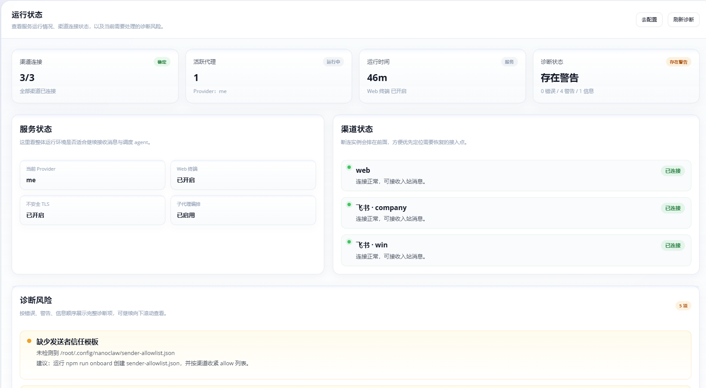

#### 系统配置

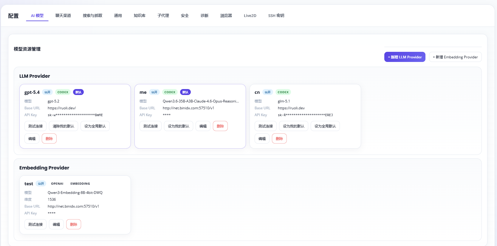

#### 用户管理

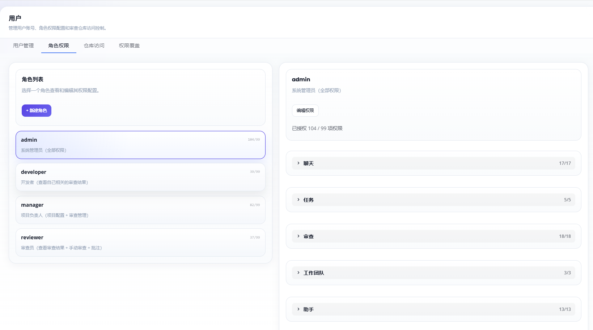